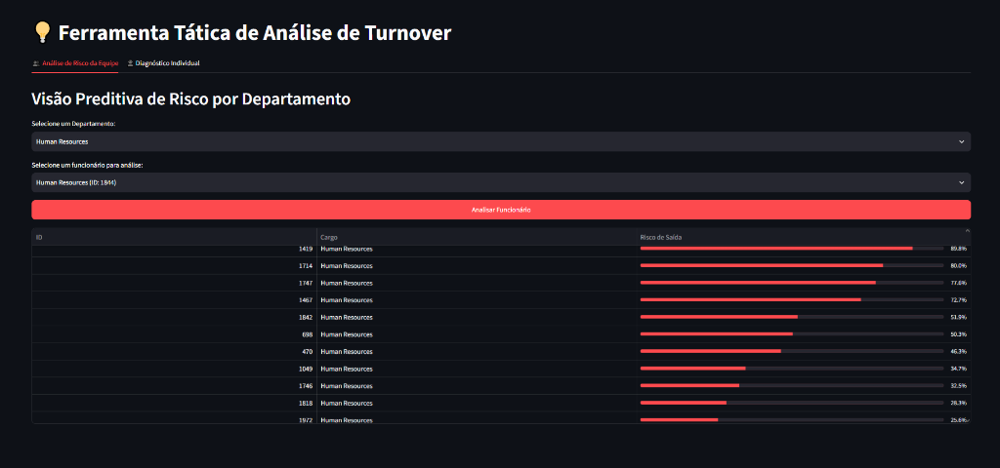
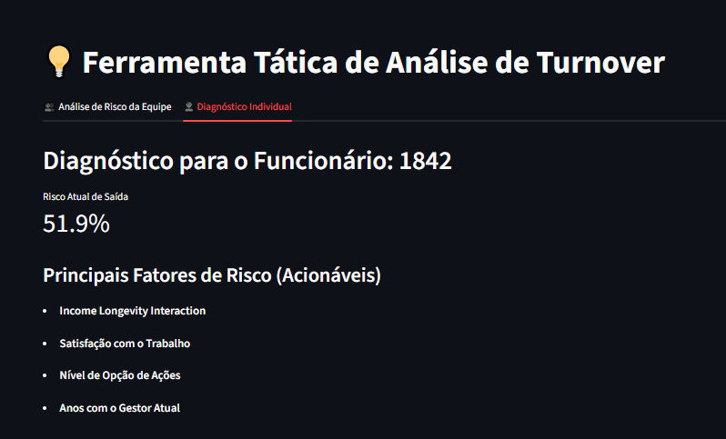
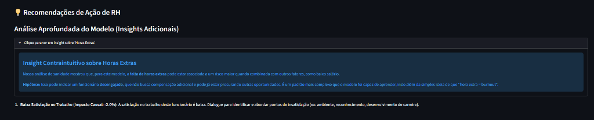
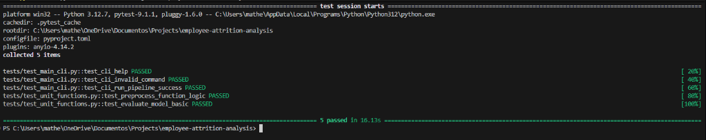

# 🧠 Análise e Predição de Turnover — People Analytics & IA Prescritiva

[](https://www.python.org/)
[](https://xgboost.ai/)
[](https://shap.readthedocs.io/)
[](https://fastapi.tiangolo.com/)
[](https://streamlit.io/)
[](https://www.postgresql.org/)

> 👔 **Para RH & Liderança (15 segundos de leitura):** Esta página resume como a inteligência artificial ajuda a antecipar desligamentos e guiar ações reais de retenção.  
> 🤓 **Para Engenheiros, Cientistas de Dados & MLOps:** Acesse a documentação técnica profunda, arquitetura *Single Source of Truth* e blindagem contra *Data Leakage* no nosso 👉 **[Guia Técnico & de Arquitetura (README_TECHNICAL.md)](README_TECHNICAL.md)**.

---

## ⏱️ Em 15 Segundos: O Problema & A Nossa Solução

* 🚨 **O Problema:** Entrevistas de desligamento são **reativas**. Quando o colaborador responde ao RH, o talento já foi perdido.
* 💡 **A Solução:** Um sistema preditivo que avalia **49 indicadores operacionais** e alerta antecipadamente quais colaboradores estão em zona de risco crítico — com **80% de precisão** nos alertas.
* 🎯 **Fim da Caixa Preta:** O sistema não apenas aponta *quem* vai sair, mas **por que** (explicabilidade SHAP) e **o que fazer para retê-lo** (recomendações causais).

---

## 📊 O App em Ação (Dashboard Tático de RH)

### 1. Ranking Preditivo por Departamento (Visão Geral)
Permite ao HR Business Partner (HRBP) filtrar por área (ex.: *Human Resources*, *Sales*, *R&D*) e visualizar imediatamente os colaboradores priorizados pelo risco de saída.



---

### 2. Diagnóstico Individual & Explicabilidade SHAP
Ao selecionar qualquer funcionário na tabela (ex.: Colaborador #1842, com **51.9% de probabilidade de saída**), o modelo isola os **fatores acionáveis** que estão aumentando o risco — eliminando da interface variáveis imutáveis como idade ou gênero.



---

### 3. IA Prescritiva: Recomendações Causais & Insights Contraintuitivos
O sistema calcula o impacto percentual que cada intervenção de RH trará para reter o talento (ex.: *"-2.0% ao melhorar satisfação no trabalho"*) e apresenta correlações complexas aprendidas pelo modelo.



---

## 📈 Impacto no Negócio

| Métrica | Desempenho (Prod) | O Que Significa para o RH |
| :--- | :---: | :--- |
| **Precisão (Precision)** | **80%** | **8 em cada 10 alertas críticos são certeiros.** Evita gasto orçamentário em retenções desnecessárias. |
| **Acurácia Global** | **85%** | Alta confiabilidade no diagnóstico global do quadro de funcionários. |
| **Threshold Calibrado** | **0.98 (Otimizado)** | Proteção máxima contra falsos alarmes, direcionando foco da liderança onde o risco é iminente. |

---

## 🛡️ Confiabilidade Técnica & MLOps (Zero Data Leakage)

O projeto conta com arquitetura **Single Source of Truth** (`src/attrition/features.py`), API REST em **FastAPI** e suíte completa de testes automatizados rodando **100% no verde**, sem vazamento de dados (*Data Leakage*):



---

## 🔗 Próximos Passos
* 📖 Leia a [Arquitetura Técnica e MLOps Completa (README_TECHNICAL.md)](README_TECHNICAL.md)
* 🚀 Execute localmente com apenas dois comandos Python:
  ```powershell
  # Abrir o Dashboard do RH (Streamlit)
  py -3.12 -m streamlit run app/main_app.py

  # Abrir a API REST Operacional (FastAPI + Swagger)
  py -3.12 -m uvicorn api.main:app --reload
  ```